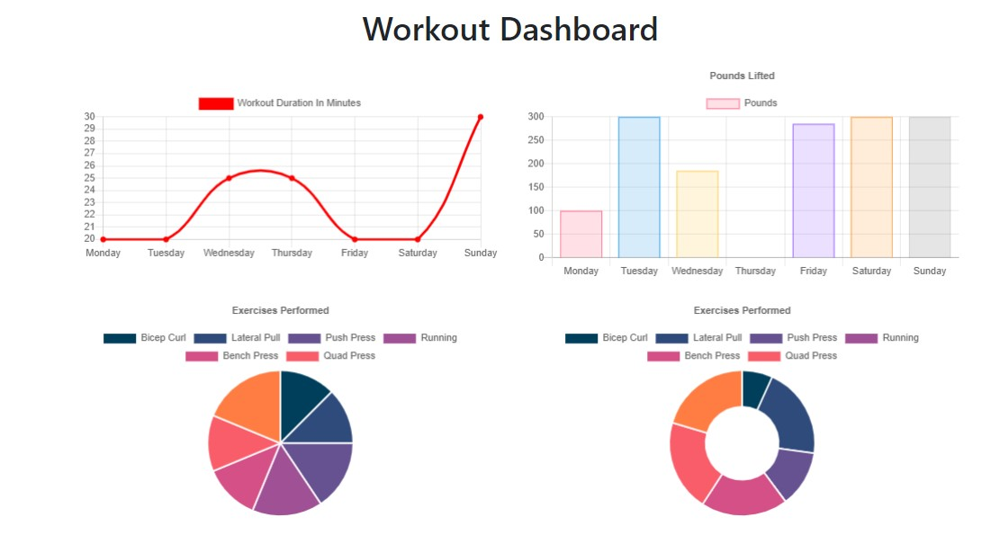
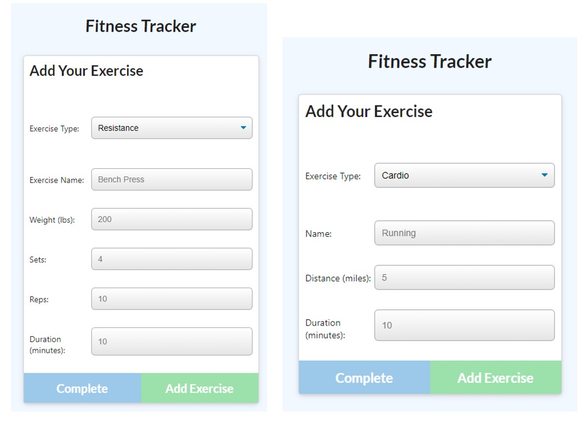
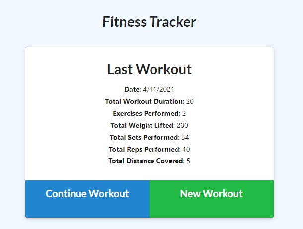

   

# 
 **Fitness Tracker** 

--- 

---

## **Table Of Contents** 

---

1. [Description](#description)
2. [Installation](#installation)
3. [Usage](#usage)
4. [Deployment](#github)
5. [Contact](#contact)

--- 

## 
 **Description** 
 

--- 

This app allows users to view, create, and track daily workouts. Multiple exercises in a workout can be logged and are then encorporated into totals, stats, and range. 

--- 
 
## 
 **Installation** 

--- 
 
Fitness Tracker is live on Heroku.  <ol>
<li>If you would like to download it locally, clone the repo and run `npm i`.  This will install all dependencies</li>
<li>npm run seed will import the seed data.</li>
<li>Initialize the app in the command line with `npm start` </li>
<li>In the command line note which port the server is being run on and input `localhost:{givenPORT}` in the browser</li>
</ol>

--- 

## 
 **Usage** 

---

--- 
<ol>
<li>The app will always load the last-entered workout.</li>
<li>The workout can be updated, or a new workout can be logged. </li>
<li>Choose cardio or resistance and fill in the fields. Click Add Exercise to add more workouts or click Complete. </li>
<li> The user can then view a summary of their workout.</li>  
<li>From the dashboard, stats are given. </li>
<li>Take advantage of this app to meet your fitness goals!</li>
</ol>

--- 

---

## 
 **Deployment** 

---

<ul>
   <li>

### _Github:_ https://github.com/markkimeyer/fitness-tracker
</li>
<li>

### _Heroku:_ https://mm-fitness-tracker.herokuapp.com/
</li>
</ul>

---
## 
 **Contact** 

---

 Email: markkimeyer@gmail.com 

